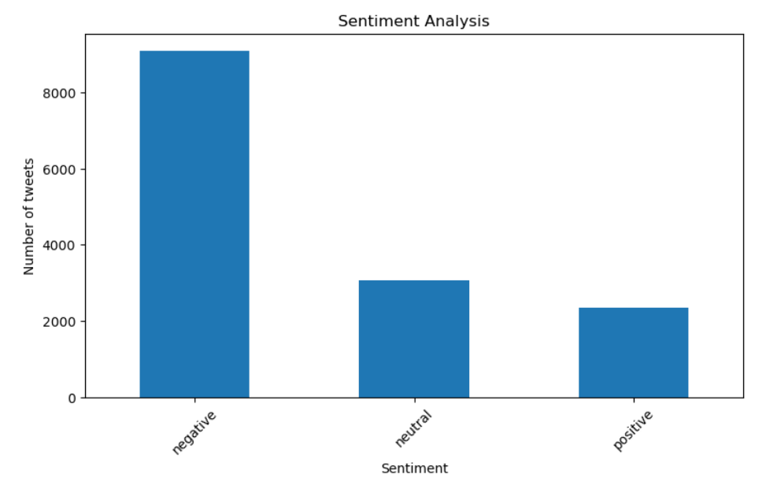
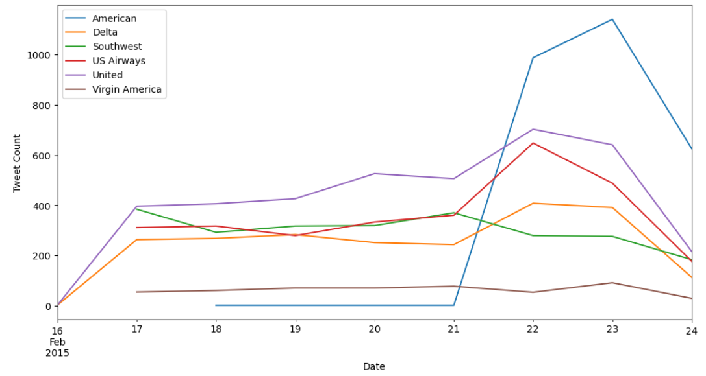
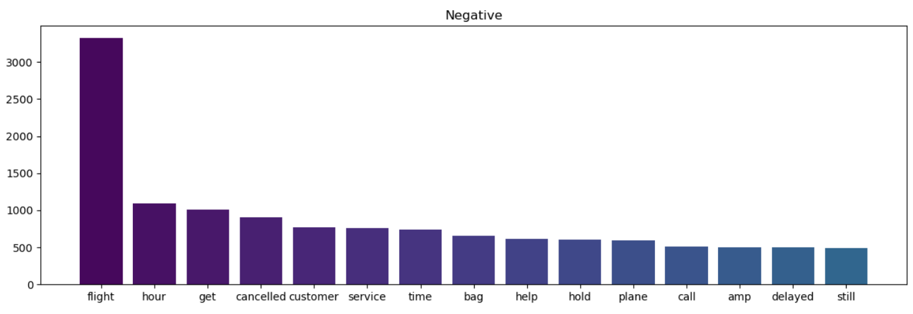
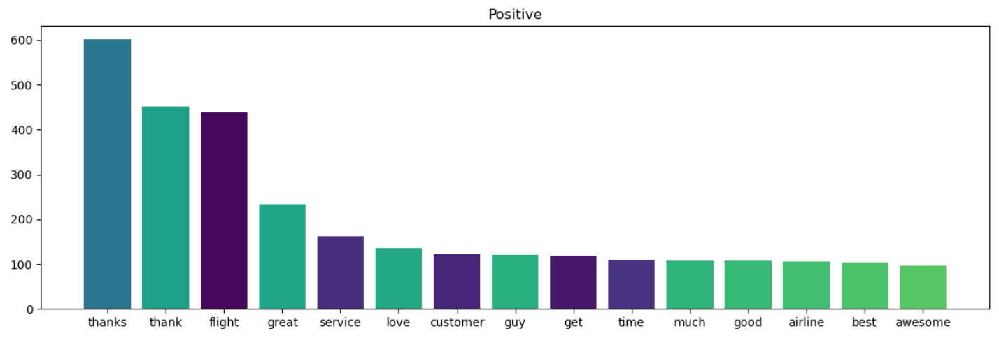

# SEMANTIC ANALYSIS OF AIRLINE TWEETS

Authors: Scholar Chepkirui | Moses Kuria | Penina Wanyama | Stephen Thuo

## Overview
In the highly competitive airline industry, leveraging sentiment analysis can provide a competitive edge. By analyzing social media posts, sentiment analysis can determine whether the sentiment of the feedback is positive, negative, or neutral. This can provide valuable insights into customers' opinions and preferences, aid in identifying common complaints, monitor trends in customer feedback, and enable the development of targeted strategies to enhance customer satisfaction and loyalty.  

## Business Problem

The airline industry is constantly facing challenges that require them to innovate and improve their service offerings, all while keeping their operational costs low. By gaining a deeper understanding of customer preferences through NLP, airlines can take proactive measures to improve overall customer satisfaction. Using machine learning techniques, airlines can accurately predict the sentiment of their passengers based on their tweets. This means that they can quickly identify and address any issues before they escalate, reducing the likelihood of negative customer experiences and increasing customer loyalty.

## Data
The airline_tweets dataset was obtained from [Kaggle](https://www.kaggle.com/datasets/crowdflower/twitter-airline-sentiment). Data was scraped from Twitter and contributors were asked to first classify positive, negative, and neutral tweets.

## Methods
This project uses NLP, Sentiment analysis techniques and Neural Networks. The steps taken business understanding, data understanding, data preparation, modeling and evaluation

### Exploratory Data Analysis
Number of Tweets per Airline: There are a total of 6 airlines.

Distribution of sentiment categories

Tweets trend over time

200 most frequently used words in the tweets

### Data Preparation
- Checking for missing values and duplicates
- Preprocessing the text to remove emojis, punctuation, stopwords, hyperlinks and lemmatize the words
The top 15 words in the negative and positive sentiment category

- Splitting the data into train, test and validation sets
- One-hot encoding the texts and encoding the categorical labels
- Padding the sequences to a fixed length

### Modeling
The sentiment analysis techniques, TextBlob and VADER, were used to analyze and classify the sentiment of textual data. 
Recursive Neural Networks, Simple RNN and LSTM,are used to build models that classificaty the tweets as either positive, negative or neutral. These models are capable of learning dependencies between words and maintaining context over long sequences, making them useful for tasks like sentiment analysis and text classification. 

## Conclusions and recommendations

## Future work

##  For More Information
See the full analysis in the [Jupyter Notebook](https://github.com/Scholarchep/semantic-analysis-of-airline-tweets/blob/main/airline_tweets.ipynb) or review this [presentation](https://github.com/Scholarchep/King-County-housing-price-predictions/blob/main/presentation.pdf).

## Repository Structure
 
├── data                                      <- Both sourced externally and generated from code  
├── images                                    <- Both sourced externally and generated from code  
├── Data_report.docx                          <- word document of project report  
├── README.md                                 <- The top-level README for reviewers of this project  
├── presentation.pdf                          <- PDF version of project presentation  
└── airline_tweets.ipynb                      <- Narrative documentation of analysis in Jupyter notebook  
`

